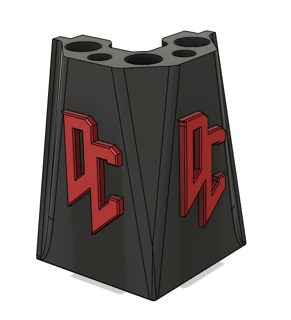
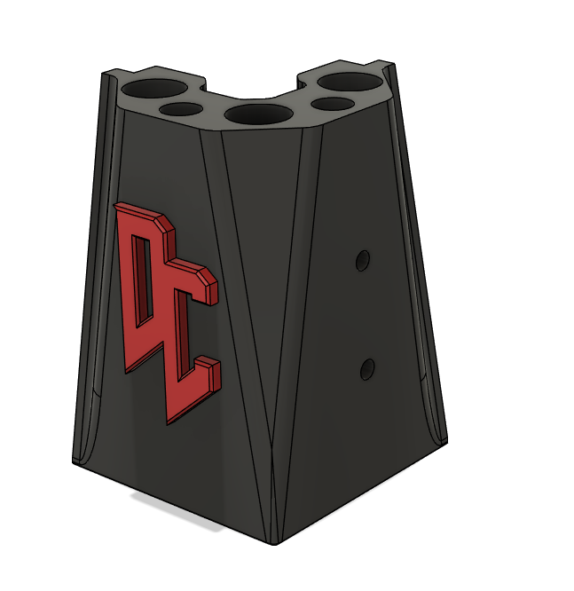
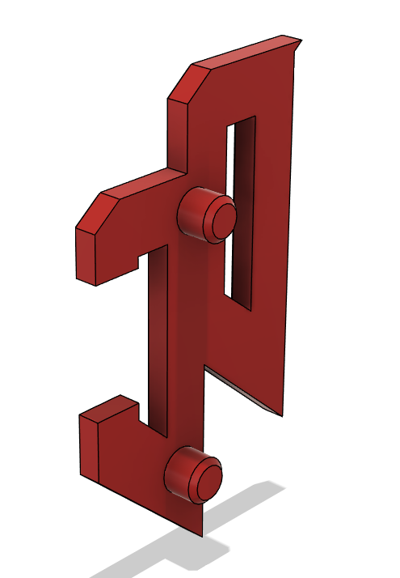

# Dual Color Logo Upper Corners
This is an alternative to the upper corners for standard 4040 DOOM that uses a separate print in the accent color for the logo, this just press fits into the main upper corner, should be glued or acetone welded in 

		

##### Pictures

