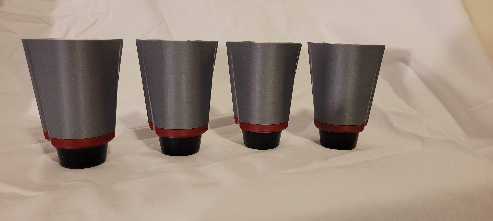
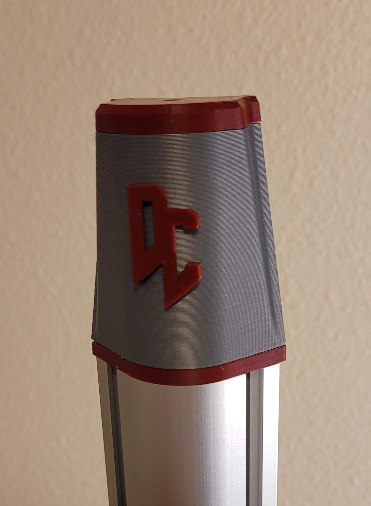
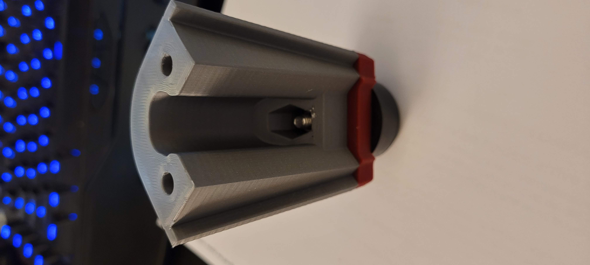

# Rounded Extrusions DOOM CUBE
These are attached to the outside of the stock V2.4 vertical extrusions can be down 2 ways. If you want to keep it clean with no screws shown you can do blind holes coming from the stock 2020 into the 4040, or if you dont care you can go blind joints the other direction which would make it easier to install on an already built V2.

BOM

4040 Extrusions - Pre Tapped
Item|Misumi Part#| Qty
----|------------|---|
Vertical Rounded Extrusions 250|HFSR5-404020-430-TPW|4
Vertical Rounded Extrusions 300|HFSR5-404020-480-TPW|4	
Vertical Rounded Extrusions 350|HFSR5-404020-530-TPW|4	

4040 Extrusions - DIY
Item|Misumi Part#| Qty
----|------------|---|
Vertical Rounded Extrusions 250|HFSR5-404020-430|4
Vertical Rounded Extrusions 300|HFSR5-404020-480|4	
Vertical Rounded Extrusions 350|HFSR5-404020-530|4			

Screws			
Size|Qty
---|---		
M5x6|16	
M5 Nuts|16		

##### Pictures

